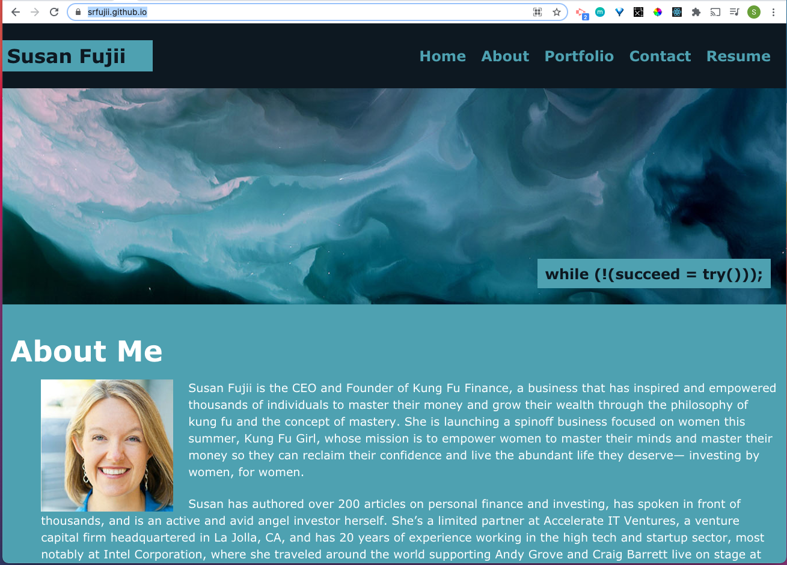
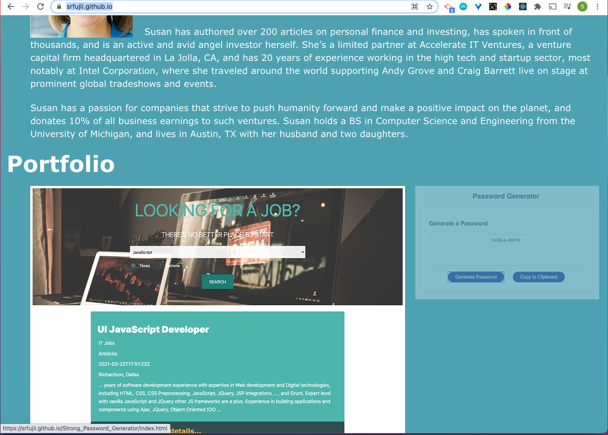
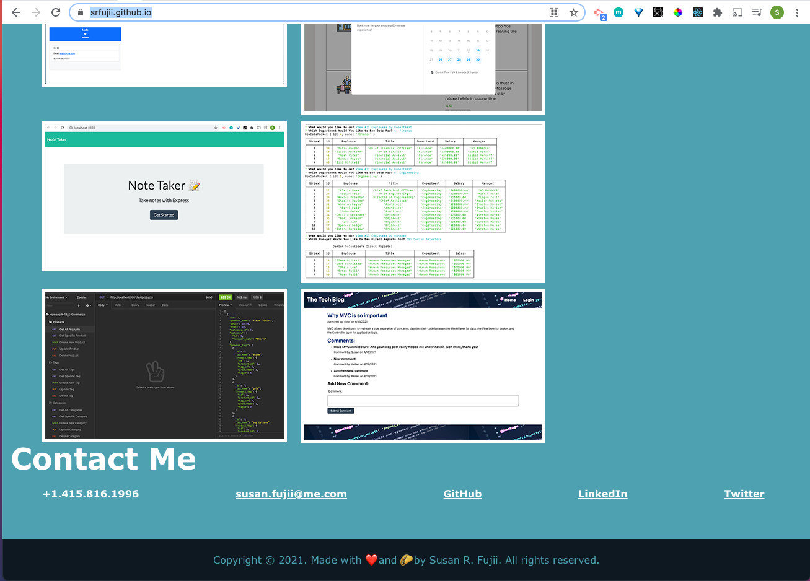
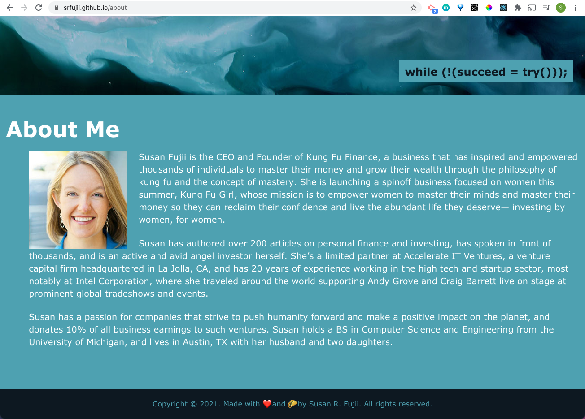
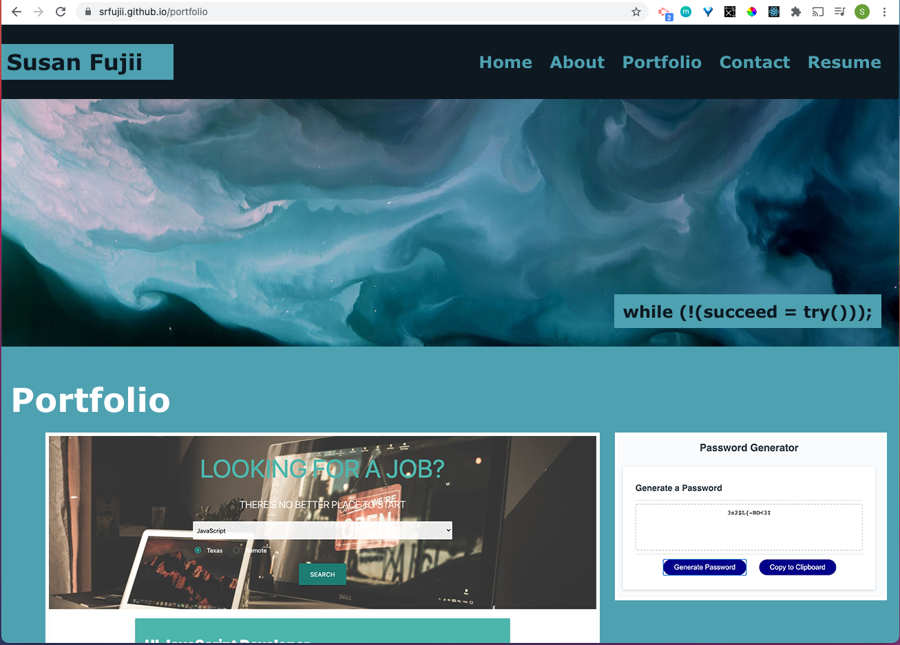
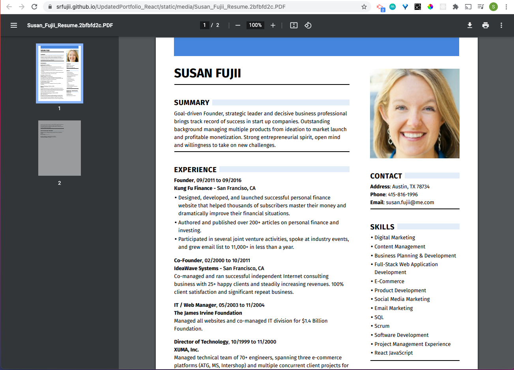

# Susan Fujii Updated React Portfolio
  [](https://opensource.org/licenses/MIT)

  ## Description

    This The purpose of this project is to update my online portfolio of work using React to showcase my skills with potential employers.

    This web application is **accessible** to users who will view it both on larger computer screens and also on smaller screen sizes, and the code is **up to current industry standards** and **uses best known practices**.


  ## Table of Contents

  * [Installation](#installation)
  * [Usage](#usage)
  * [Screenshots](#screenshots)
  * [License](#license)
  * [Contribute](#contribute)
  * [Tests](#tests)
  * [Questions](#questions)
 

  ## Installation

  This app is deployed live on GitHub Pages, and you can find it live here:

  [Live Deployed Application](https://srfujii.github.io/UpdatedPortfolio_React/)
  

  To install locally, do the following: 
  
  To install necessary dependencies, run the following command:

  ```
  npm i
  ```

  To start the application, run:

  ```
  npm start
  ```

  This project was bootstrapped with [Create React App](https://github.com/facebook/create-react-app).


  ## Usage

  This is a student repo.


  ## Screenshots

  
  
  
  
  
  


  ## License

  [](https://opensource.org/licenses/MIT) This project is licensed under the [MIT](https://opensource.org/licenses/MIT) license.


  ## Contribute

  Contributions are always welcome! (Please fork and pull request only.)


  ## Tests

  To run tests, run the following command: 

  ```
  npm test
  ```

  ## Questions

  If you have any questions about the repo, open an issue or contact me directly at susan.fujii@me.com. You can find more of my work at [srfujii](https://github.com/srfujii/).
